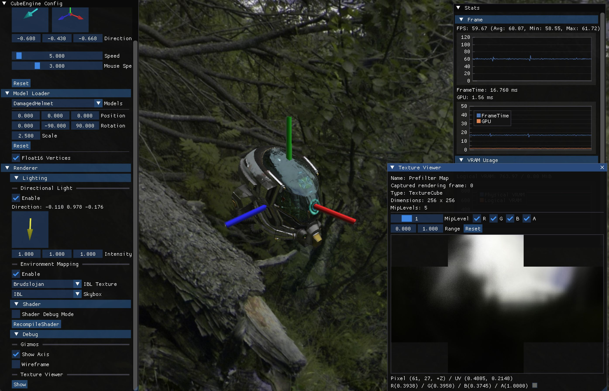

# CubeEngine

A simple realtime rendering engine for studying rendering and graphics APIs.

# Screenshots

* 

# Features

* Multi-platform
  * Windows - DirectX 12
  * macOS - Metal
* Track resources via Render Graph (Similar to FrameGraph in Frostbite and RDG in Unreal Engine)
* PBR rendering
* Graphics debugging
  * Runtime shader recompilation
  * Texture viewer
* Vector / Matrix using SIMD (SSE, AVX2, NEON)

# License

* MIT
